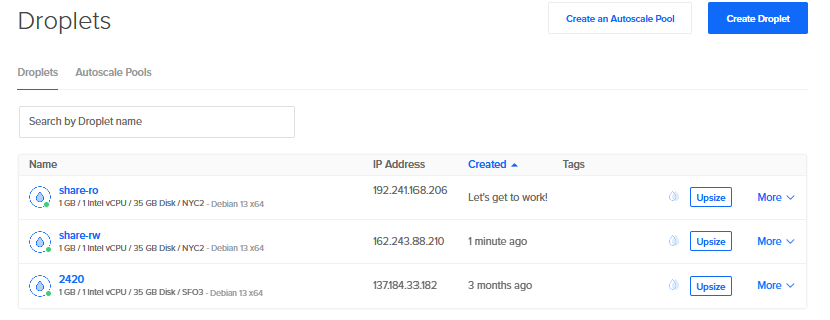

# 2420 In-Class Week 14

This submission is partial because DigitalOcean blocked creation of the required Network File Storage share on this account.

The blocker shown in the DigitalOcean control panel was:

`Looks like you've hit the NFS limit. Request an increase.`

Because the NFS share could not be created, I could not complete the mount configuration, mount status checks, or the file server test that depended on a real NFS share.

## Completed Work

- Created both Debian 13 droplets in `NYC2`
- Provisioned both droplets with `cloud-init`
- Created the `mateu` user and added the required packages in `cloud-config.yaml`

## Completed `cloud-config.yaml`

```yaml
#cloud-config
users:
  - name: mateu
    primary_group: mateu
    groups: sudo
    shell: /bin/bash
    sudo: ["ALL=(ALL) NOPASSWD:ALL"]
    ssh-authorized-keys:
      - ssh-ed25519 AAAAC3NzaC1lZDI1NTE5AAAAICzsgRV2kkQqs99T/3MDVCw+zqwwOymi7I0WIxLaDZRT digitalocean-debian

write_files:
  - owner: root:root
    path: /etc/caddy/Caddyfile
    content: |
      :80 {
        root * /mnt/share
        file_server browse
      }

package_update: true
package_upgrade: true

packages:
  - ripgrep
  - rsync
  - git
  - nfs-common

disable_root: true

runcmd:
  - sed -i -e '/^PermitRootLogin/s/^.*$/PermitRootLogin no/' /etc/ssh/sshd_config
  - systemctl restart ssh
  - useradd -rmd /home/caddy -s /usr/sbin/nologin caddy
  - mkdir -p /mnt/share
```

## Droplets Created

- `share-rw`: `162.243.88.210`
- `share-ro`: `192.241.168.206`


